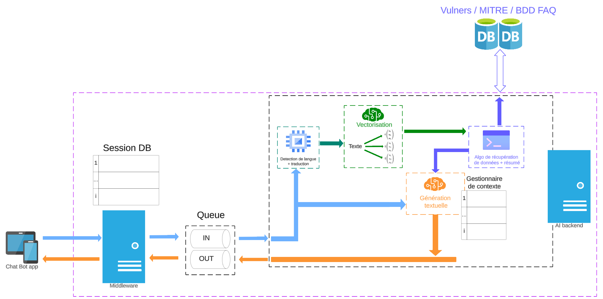

# Talk2Eve - Main Project
Talk2Eve is a Mult-Framework based chatbot that revolves around using the MITRE ATT&CK knowledge base. 

Below, the 5 parts the project needs to function :
- Flutter App : https://github.com/B3LIOTT/chatbot_insa
- MiddleWare (Flask) : https://github.com/aymane59/ChatBot_echanges
- RabbiMQ (we used a docker)
- Ai (Transformers and MITRE) : https://github.com/Malchemis/Talk2Eve-AI
- MongoDB database (also a docker)

## Configuration
To make this service available from anywhere, we set up a formarding port from a router with a domain name (port 44444) to a Nginx web server (port 443 TLS). Nginx acts as a reverse proxy, transferring requests to a UNIX server running locally on 127.0.0.1:8000: Gunicorn.
1. Create an Nginx server with 127.0.0.1:8000 as reverse proxy and run it with:
```bash
sudo systemctl start nginx
```

2. run the Gunicorn WSGI with the Flask socketio app:
 ```bash
gunicorn --workers 1 --worker-class eventlet -b 127.0.0.1:8000 wsgi:app
```

## The architecture


